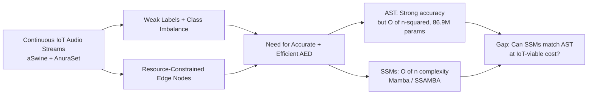
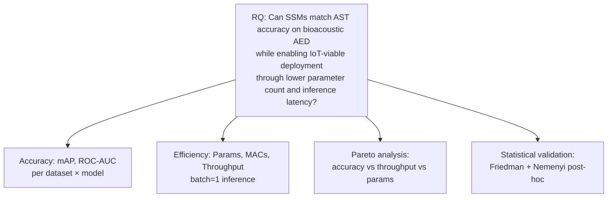
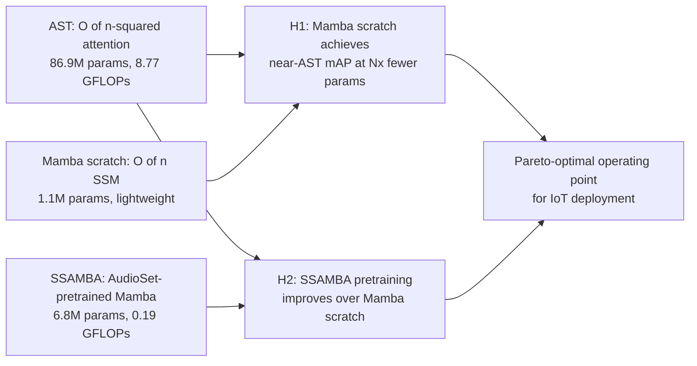
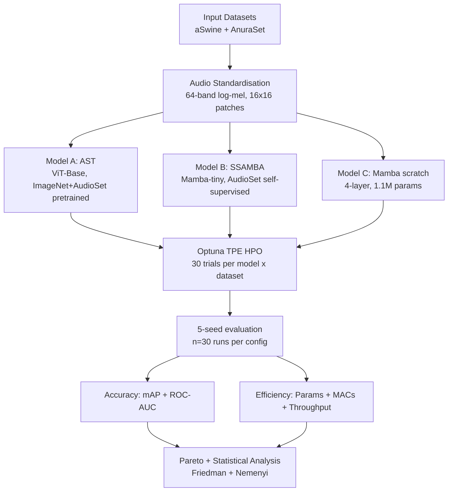
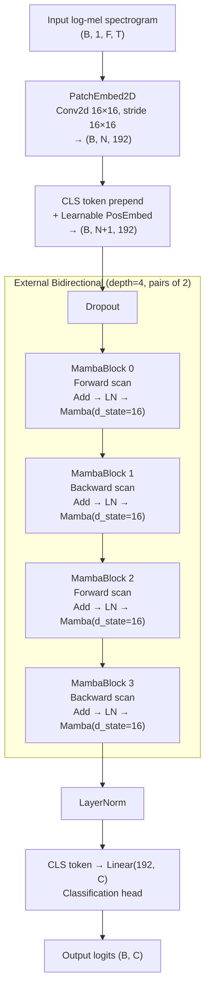
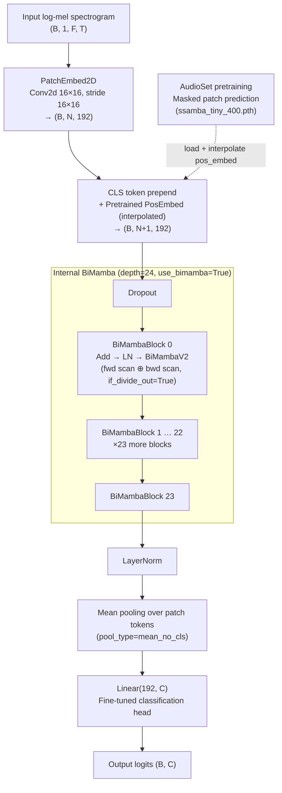

# BioAED — Bioacoustic Audio Event Detection

> **State-Space Models vs. Transformers for Bioacoustic Event Detection in IoT Sensor Streams: An Efficiency-Aware Benchmark**

## Abstract

Passive acoustic monitoring supports biodiversity and livestock assessment, but accurate detectors remain difficult to deploy on resource-constrained sensors. We present a controlled benchmark of AST (86.9 M parameters), SSAMBA (AudioSet-pretrained Mamba, 6.8 M), and Mamba scratch (1.1 M) on two IoT-relevant bioacoustic datasets (*aSwine*, *AnuraSet*) under model-based HPO and 5-seed evaluation. Mamba scratch achieves 96.8% of AST mAP (0.849 vs. 0.877 on AnuraSet) with 80× fewer parameters and 8.9× higher throughput, while SSAMBA adds +1.4–3.7 pp mAP without single-segment speed gains. Friedman tests (*p* < 10⁻³) and Pareto analysis indicate that Mamba scratch is the efficiency-first choice under our profiled hardware setting, whereas SSAMBA suits accuracy-oriented use when modest extra latency is acceptable.

---

Research codebase for comparing **Audio Spectrogram Transformer** (AST), **SSAMBA** (self-supervised Mamba pretrained on AudioSet), and **Mamba (scratch)** (compact SSM trained from scratch) on weakly-labeled bioacoustic datasets.

## Motivation & Contributions

### Problem Context

Deploying Audio Event Detection on continuous IoT sensor streams in agricultural and ecological settings poses a three-fold challenge:

- **Accuracy vs. efficiency gap.** AST delivers strong accuracy but its 86.9 M parameters and quadratic $O(n^2)$ self-attention make real-time edge deployment infeasible. Prior work (Souza et al., SBBD 2025) confirmed AST as the strongest single-model baseline on aSwine; the challenge is matching that accuracy at a fraction of the cost.
- **SSMs as candidate alternatives.** Mamba offers linear-time $O(n)$ selective state spaces that can model global temporal context efficiently. SSAMBA extends Mamba to audio via self-supervised pretraining on AudioSet. Neither has been benchmarked against AST on in-situ IoT bioacoustic datasets under controlled HPO.
- **Limited cross-domain validation.** Prior bioacoustic AED studies are typically validated on a single dataset, leaving generalisability across species, noise profiles, and segment durations undemonstrated.

### Research Question

> **RQ:** Can SSMs match AST accuracy on bioacoustic AED while enabling IoT-viable deployment through lower parameter count and inference latency?

### Contributions

1. **A controlled benchmark** of three architectures — AST, SSAMBA, and Mamba (scratch) — on two bioacoustic datasets spanning different ecological domains and class cardinalities (7 and 42 classes).
2. **Model-based HPO** (Optuna TPE, 30 trials per model×dataset combination, 180 total) followed by 5-seed evaluation, yielding robust mean and variance estimates.
3. **Pareto-efficiency analysis** across accuracy, inference throughput, and parameter count, providing deployment-ready guidance for IoT practitioners.
4. **Statistical validation** via Friedman omnibus test and Nemenyi post-hoc tests.

## Research Blueprint (Mermaid)

### 1) Motivation and Problem Framing



### 2) Research Question



### 3) Premises and Testable Hypotheses



### 4) Experimental Methodology



## Model Architectures

### Mamba (scratch) — 4-layer external bidirectional SSM



> **Mamba scratch** uses *external* bidirectionality: layers alternate forward/backward scan direction in pairs. No pretraining — weights are randomly initialised. 1.1 M parameters.

---

### SSAMBA (pretrained) — 24-layer internal BiMamba



> **SSAMBA** uses *internal* bidirectionality: each `BiMambaV2` block runs forward and backward SSM scans in parallel and averages their outputs (`if_divide_out=True`). Weights are loaded from the SSAMBA-tiny AudioSet checkpoint and fine-tuned end-to-end. 6.8 M parameters.

---

## Quickstart

```bash
# 1. Install uv (if not already installed)
curl -LsSf https://astral.sh/uv/install.sh | sh

# 2. Install dependencies (CPU-only)
make install

# 3. Install with CUDA support (for SSAMBA + GPU training)
make install-cuda

# 4. Run HPO sweep (Optuna TPE, 30 trials)
python -m bioaed.sweep model=audio_mamba_pretrained dataset=aswine

# 5. Run ablation (5-seed evaluation with best HPO params)
python -m bioaed.ablation

# 6. Generate reports (stats, figures, LaTeX tables)
python -m bioaed.evaluation.report_generator

# 7. Run linters
make lint && make typecheck
```

## Project Structure

```
sbbd2026/
├── configs/              # Hydra YAML configuration files
│   ├── config.yaml       # Top-level defaults composition
│   ├── dataset/          # Dataset configs (aswine, anuraset)
│   ├── model/            # Model configs (ast, audio_mamba)
│   └── training/         # Training hyperparameters
├── data/                 # Raw datasets (git-ignored)
│   ├── anuraset/         # AnuraSet (42 species, 3s segments)
│   └── aswine/           # aSwine (7 classes, 1s segments)
├── src/bioaed/           # Source package
│   ├── data/             # Dataset adapters & datamodule
│   ├── features/         # Audio transforms & feature extraction
│   ├── models/           # AST, Audio Mamba / SSAMBA
│   ├── training/         # Lightning Fabric trainer
│   ├── evaluation/       # Metrics, profiler, report generator
│   ├── hpo/              # Optuna TPE hyperparameter optimisation
│   └── utils/            # Logging, reproducibility, config schemas
├── tests/                # Unit & integration tests
├── pyproject.toml        # Project config (uv, ruff, mypy, pytest)
├── Makefile              # Development shortcuts
└── Dockerfile            # GPU-ready container
```

## Datasets

| Dataset      | Domain              | Samples  | Classes | Segment | Sample Rate |
| :----------- | :------------------ | :------- | :------ | :------ | :---------- |
| **aSwine**   | PLF (Swine)         | ~54,000  | 7       | 1s      | 16 kHz      |
| **AnuraSet** | Ecoacoustics        | 93,378   | 42      | 3s      | 22,050 Hz   |

Both datasets were collected by in-situ IoT acoustic sensors deployed in the field, directly representing the target deployment scenario.

## Models

| Model | Architecture | Params | GFLOPs | Pretraining |
| :---- | :----------- | -----: | -----: | :---------- |
| **AST** | ViT-Base, 16×16 patches | 86.9 M | 8.77 | ImageNet + AudioSet |
| **SSAMBA** | Mamba-tiny encoder, 24 layers | 6.8 M | 0.19 | AudioSet (masked patch) |
| **Mamba (scratch)** | 4-layer Mamba encoder | 1.1 M | — | None |

- **AST** — dominant accuracy baseline; prohibitive for edge deployment.
- **SSAMBA** — self-supervised Mamba pretrained on AudioSet; fine-tuned end-to-end. Intermediate accuracy–efficiency point.
- **Mamba (scratch)** — compact SSM trained from random initialisation; Pareto-optimal for throughput-constrained IoT nodes.

> **Note:** InceptionTime was evaluated in prior work (Souza et al., SBBD 2025) and is not re-evaluated here.

## Citation

```bibtex
@article{Souza2025,
  title   = {Deep learning solutions for audio event detection in a swine barn
             using environmental audio and weak labels},
  journal = {Applied Intelligence},
  volume  = {55},
  number  = {7},
  author  = {Souza, André Moreira and others},
  year    = {2025},
}
```
