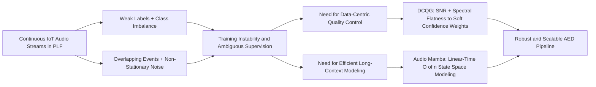
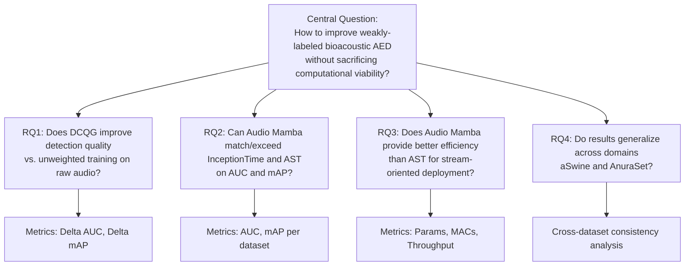
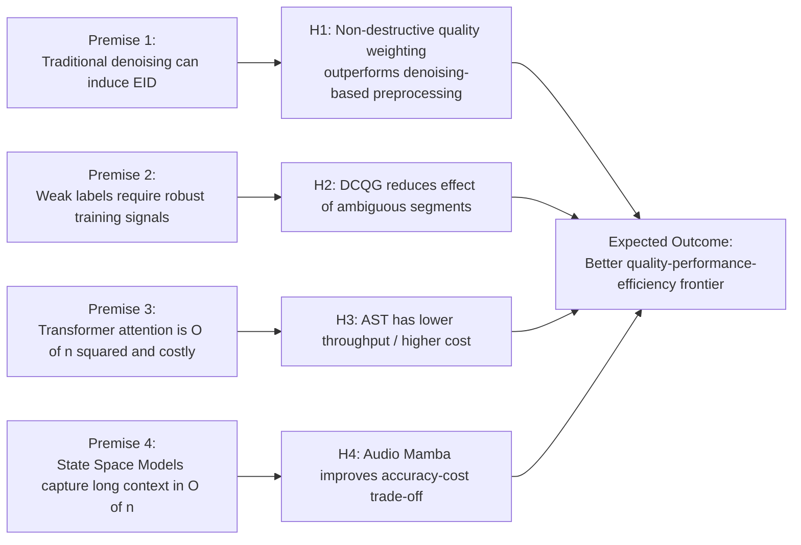
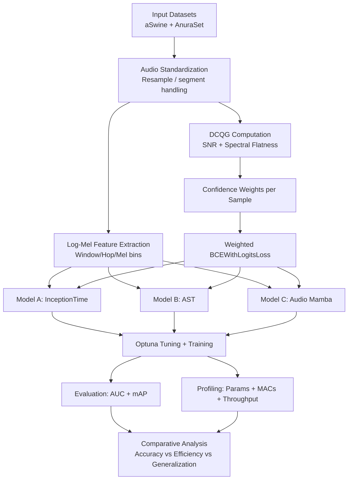

# BioAED — Bioacoustic Audio Event Detection

> **Data-Centric Quality Gating and Linear-Time State Space Models for Weakly-Labeled Bioacoustic Event Detection in IoT Sensor Streams**

## Abstract

Continuous acoustic monitoring of livestock and wildlife via IoT sensors produces high-volume, weakly-labeled audio streams where overlapping sound sources, non-stationary noise, and the absence of precise temporal annotations severely limit automated event detection. Prior work on swine barn Audio Event Detection (AED) has shown that (i) 1D-CNNs such as InceptionTime outperform adapted vision models in efficiency, and (ii) traditional algorithmic denoising actively degrades deep learning classifiers, a phenomenon termed Enhancement-Induced Degradation (EID). Two critical gaps remain: convolutional architectures are restricted to local temporal receptive fields, while the Audio Spectrogram Transformer's (AST) quadratic $O(n^2)$ attention complexity renders it impractical for resource-constrained, edge-based stream processing.

This paper addresses both gaps through two contributions:

1. **Data-Centric Quality Gate (DCQG).** Rather than altering raw waveforms, we compute non-destructive acoustic metrics — Signal-to-Noise Ratio (SNR) and Spectral Flatness — per weakly-labeled segment and map them through a shifted-sigmoid function to produce soft confidence weights $w_i \in [0, 1]$ that modulate the per-sample training loss. Clean, tonal samples contribute fully to the gradient update, while noisy, spectrally flat segments are smoothly down-weighted. Because the raw audio is never modified, the spectrogram seen by the model is identical with or without the gate — avoiding the feature distortion and distribution shift that cause EID.

2. **Audio Mamba (AuM).** We evaluate a Bidirectional State Space Model with linear-time $O(n)$ complexity as a sequence architecture capable of global temporal context modeling at a fraction of the Transformer's computational cost, bridging the accuracy–efficiency gap between InceptionTime and the AST.

We benchmark InceptionTime, AST, and AuM — each with and without DCQG — on two bioacoustic corpora spanning distinct ecological domains: the public **aSwine** corpus (7 behavioral classes, 1 s segments, swine barn environment) and the public **AnuraSet** benchmark (42 neotropical anuran species, 3 s segments, passive acoustic monitoring). Models are evaluated on classification efficacy (AUC, mAP) and computational viability (parameter count, MACs, inference throughput), providing a systems-oriented analysis aligned with IoT sensor data management in Precision Livestock Farming.

---

Research codebase for comparing **InceptionTime** (1D-CNN), **Audio Spectrogram Transformer** (AST), and **Audio Mamba** (SSM) on weakly-labeled bioacoustic datasets, with a novel data-centric quality gating mechanism.

## Motivation & Contributions

### Problem Context

Deploying Audio Event Detection on continuous IoT sensor streams in agricultural and ecological settings poses a three-fold challenge:

- **Noisy, weakly-labeled data.** Annotations are assigned to entire audio segments without precise onset/offset markers, and recordings are corrupted by overlapping sources and non-stationary environmental noise. Traditional denoising worsens classifiers (EID), yet ignoring data quality leaves models vulnerable to ambiguous supervision.
- **Architectural trade-offs in sequence modeling.** Convolutional models (InceptionTime) are efficient but capture only local temporal dependencies. Transformer models (AST) capture global context but scale quadratically in time and memory, making real-time edge deployment infeasible.
- **Limited cross-domain validation.** Prior bioacoustic AED studies are typically validated on a single dataset, leaving generalizability across species, noise profiles, and segment durations undemonstrated.

### Contributions

This work makes the following contributions:

1. **A non-destructive, data-centric quality gating mechanism (DCQG)** that computes per-sample SNR and Spectral Flatness scores, maps them through shifted-sigmoid functions to soft confidence weights, and uses these weights to modulate the per-sample cross-entropy loss — improving robustness to label noise and low-quality segments without altering the raw audio signal.
2. **A systematic evaluation of Audio Mamba (AuM)**, a Bidirectional State Space Model with $O(n)$ complexity, as a drop-in alternative to both local-context 1D-CNNs and quadratic-cost Transformers for bioacoustic event classification.
3. **A multi-domain experimental benchmark** comparing three architecturally distinct model families (InceptionTime, AST, AuM) across two ecologically diverse datasets (aSwine and AnuraSet), assessed on both classification performance (AUC, mAP) and computational efficiency (parameters, MACs, throughput).
4. **An analysis of the interaction between data-centric quality weighting and model architecture**, quantifying whether DCQG yields consistent gains across convolutional, attention-based, and state-space models.

### Data-Centric Quality Gate (DCQG) — Detailed Mechanism

#### Background: Why Not Just Denoise?

Prior work on the aSwine corpus demonstrated that traditional algorithmic denoising (spectral subtraction, Kalman filtering, SD-ROM) **actively degrades** deep learning classifiers — a phenomenon termed **Enhancement-Induced Degradation (EID)**. Deep models learn to treat continuous background noise as a contextual baseline; imperfect algorithmic filtering corrupts that baseline and introduces structured artifacts (e.g., "musical noise") that disrupt learned representations. Per the Data Processing Inequality, any deterministic post-processing of a noisy signal can only reduce mutual information with the classification target.

DCQG addresses this paradox: **it improves training robustness to noisy, weakly-labeled samples without altering the raw audio waveform**.

#### Mechanism

DCQG operates in three stages:

**1. Per-sample acoustic profiling.** For each raw waveform segment, two non-destructive acoustic metrics are computed *before* any feature extraction:

- **Signal-to-Noise Ratio (SNR).** Estimated via a frame-wise energy heuristic: the waveform is split into short frames (2048 samples), frame energies are sorted, and the ratio of the mean energy in the top-20% frames (signal proxy) to the bottom-20% frames (noise floor proxy) yields an SNR in decibels. *Higher SNR → cleaner, more informative sample.*

- **Spectral Flatness (Wiener entropy).** Computed as the geometric-to-arithmetic mean ratio of the power spectrum, averaged across time frames. Values near 1.0 indicate a noise-like, spectrally uniform signal; values near 0.0 indicate a tonal, structured signal. *Higher flatness → more noise-like, less informative sample.*

**2. Metric-to-weight mapping.** The two scores are converted into a single scalar **confidence weight** $w_i \in [0, 1]$ for sample $i$:

- **Soft weighting** (default): each metric is passed through a shifted sigmoid, then the two factors are multiplied:

$$w_i = \sigma\bigl(\alpha \cdot (\text{SNR}_i - \tau_{\text{SNR}})\bigr) \;\cdot\; \sigma\bigl(\beta \cdot (\tau_{\text{SF}} - \text{SF}_i)\bigr)$$

where $\tau_{\text{SNR}}$ and $\tau_{\text{SF}}$ are configurable thresholds, and $\alpha = 0.5$, $\beta = 10.0$ are sigmoid scaling factors. Samples with high SNR and low spectral flatness receive $w_i \approx 1$; noisy, flat-spectrum samples are smoothly down-weighted toward $0$.

- **Hard gating** (optional): binary — $w_i = 1$ if both thresholds are met, else $w_i = 0$.

**3. Loss modulation at training time.** The standard multi-label loss (`BCEWithLogitsLoss`) is computed per sample with `reduction="none"`, then element-wise scaled by the quality weight before averaging:

$$\mathcal{L} = \frac{1}{N} \sum_{i=1}^{N} w_i \cdot \text{BCE}(\hat{y}_i, y_i)$$

Noisy or ambiguous segments still appear in every mini-batch (the model still *sees* them), but their gradients contribute proportionally less to the parameter update. The model is never starved of data, yet it learns disproportionately from clean, well-structured samples.

#### Key Design Properties

| Property | Description |
|:---|:---|
| **Non-destructive** | Raw waveforms are never modified; the spectrogram seen by the model is identical with or without DCQG. Only the loss contribution changes. |
| **Architecture-agnostic** | The weight is a scalar attached to each sample, independent of model internals. InceptionTime, AST, and Audio Mamba all receive the same per-sample weight. |
| **Counters EID** | Because no audio transformation occurs, the feature distortion and distribution shift that cause EID are entirely avoided. |
| **Configurable** | Thresholds (`snr_threshold`, `spectral_flatness_threshold`) and strategy (`soft` / `hard`) are exposed as Hydra config parameters in `configs/quality_gate/default.yaml`. |

#### Pipeline Integration

```
raw waveform ──▶ QualityGate.compute_confidence_weight() ──▶ w_i (scalar)
     │                                                            │
     ▼                                                            ▼
 MelSpectrogram ──▶ log-mel ──▶ Model ──▶ logits ──▶ BCE(logits, y) × w_i ──▶ loss.mean()
```

In the codebase, this is wired as follows:

- `AudioDataset.__getitem__()` returns `(spectrogram, labels, quality_weight)` per sample.
- `FabricTrainer.fit()` unpacks the triplet and applies `loss_unreduced * quality_weights.unsqueeze(-1)` before calling `loss.mean()`.
- The quality gate is instantiated once in `BioacousticDataModule.__init__()` from the Hydra config, and injected into every dataset split.

## Research Blueprint (Mermaid)

### 1) Motivation and Problem Framing



### 2) Research Questions



### 3) Premises and Testable Hypotheses



### 4) Experimental Methodology



## Quickstart

```bash
# 1. Install uv (if not already installed)
curl -LsSf https://astral.sh/uv/install.sh | sh

# 2. Install dependencies (CPU-only)
make install

# 3. Install with CUDA support (for Audio Mamba + GPU training)
make install-cuda

# 4. Run training
make train

# 5. Run linters
make lint && make typecheck
```

## Project Structure

```
sbbd2026/
├── configs/              # Hydra YAML configuration files
│   ├── config.yaml       # Top-level defaults composition
│   ├── dataset/          # Dataset configs (aswine, anuraset)
│   ├── model/            # Model configs (inceptiontime, ast, audio_mamba)
│   ├── training/         # Training hyperparameters
│   └── quality_gate/     # DCAI quality gating thresholds
├── data/                 # Raw datasets (git-ignored)
│   ├── anuraset/         # AnuraSet (42 species, 3s segments)
│   └── aswine/           # aSwine (7 classes, 1s segments)
├── src/bioaed/           # Source package
│   ├── data/             # Dataset adapters & datamodule
│   ├── features/         # Quality gate & audio transforms
│   ├── models/           # InceptionTime, AST, Audio Mamba
│   ├── training/         # Lightning Fabric trainer
│   ├── evaluation/       # Metrics & system profiler
│   ├── hpo/              # Optuna hyperparameter optimization
│   └── utils/            # Logging, reproducibility, config schemas
├── tests/                # Unit & integration tests
├── pyproject.toml        # Project config (uv, ruff, mypy, pytest)
├── Makefile              # Development shortcuts
└── Dockerfile            # GPU-ready container
```

## Datasets

| Dataset    | Domain          | Samples  | Classes | Segment | Sample Rate |
| :--------- | :-------------- | :------- | :------ | :------ | :---------- |
| **aSwine** | PLF (Swine)     | ~54,000  | 7       | 1s      | 16 kHz      |
| **AnuraSet**| Ecoacoustics   | 93,378   | 42      | 3s      | 22,050 Hz   |

## Models

- **InceptionTime** — 1D-CNN with multi-scale temporal convolutions
- **Audio Spectrogram Transformer (AST)** — ViT-based, pre-trained on AudioSet
- **Audio Mamba (AuM)** — Bidirectional State Space Model with linear-time complexity

## Citation

```bibtex
@article{Souza2025,
  title   = {Deep learning solutions for audio event detection in a swine barn
             using environmental audio and weak labels},
  journal = {Applied Intelligence},
  volume  = {55},
  number  = {7},
  author  = {Souza, André Moreira and others},
  year    = {2025},
}
```
