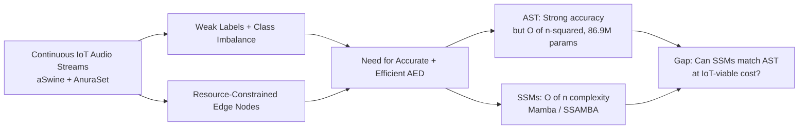
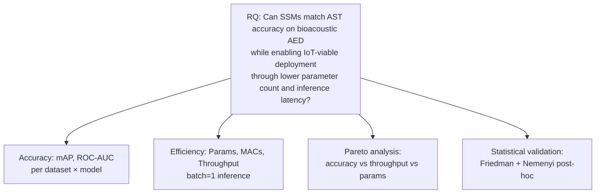
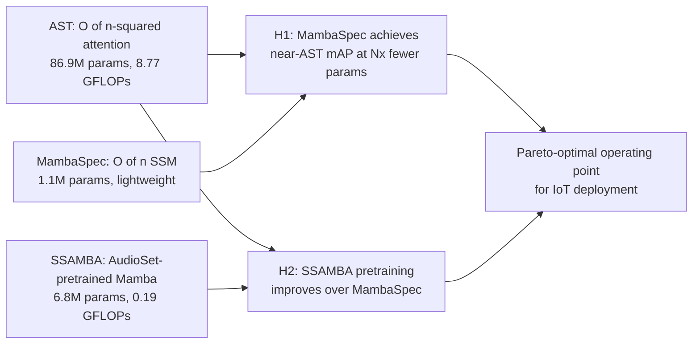
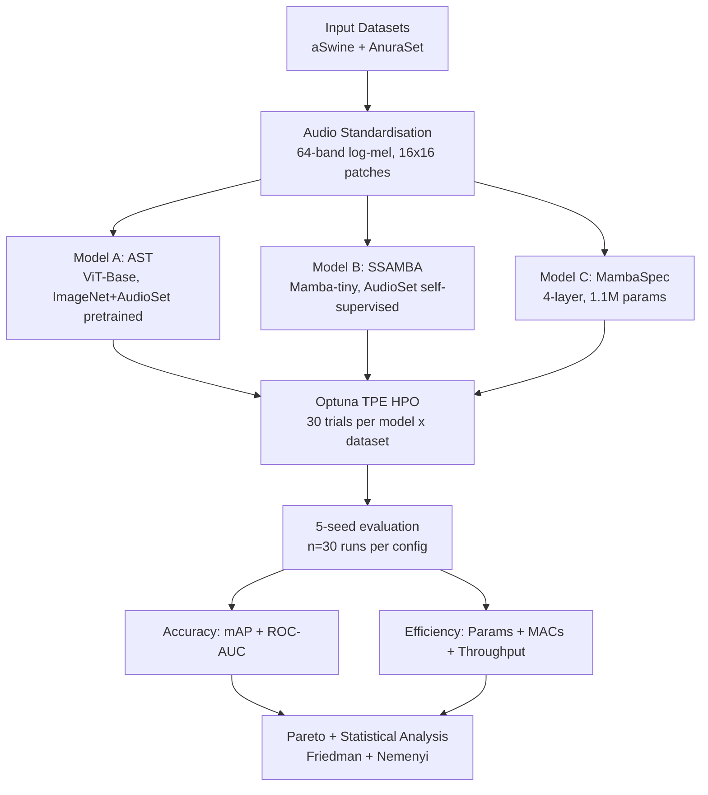
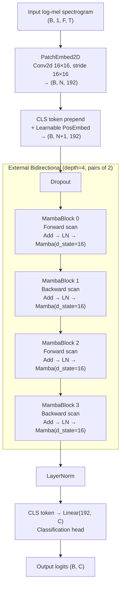
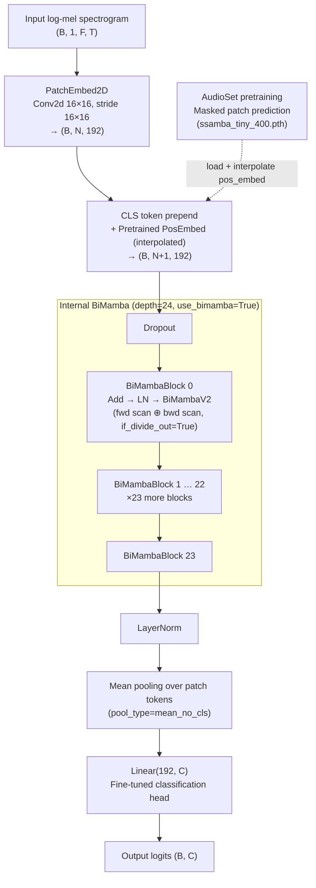

# BioAED: Bioacoustic Audio Event Detection

> **Efficiency-First Bioacoustic Audio Event Detection Under Resource-Constrained Systems** (SBBD 2026, Short Papers)

## Abstract

Passive acoustic monitoring supports biodiversity and livestock assessment, but accurate detectors remain difficult to deploy on resource-constrained sensors. We present a controlled evaluation of AST (86.9 M parameters), SSAMBA (AudioSet-pretrained Mamba, 6.8 M), and MambaSpec (compact Mamba trained from scratch, 1.1 M) on two IoT-relevant bioacoustic datasets (*aSwine*, *AnuraSet*) under hyperparameter optimization and 5-seed evaluation. MambaSpec matches AST within 0.7 pp weighted ROC-AUC on AnuraSet (0.9743 vs. 0.9812) with 80× fewer parameters and 1,617× fewer FLOPs, reaching 8.9× higher single-segment throughput, while SSAMBA is statistically indistinguishable from AST (*p* = 0.37, Nemenyi) at a 12.8× smaller footprint. Friedman tests (*p* < 10⁻³) and Pareto analysis indicate that MambaSpec is the efficiency-first choice under resource constraints, whereas SSAMBA is the accuracy-oriented choice when modest extra latency is acceptable.

---

Research codebase for comparing **Audio Spectrogram Transformer** (AST), **SSAMBA** (self-supervised Mamba pretrained on AudioSet), and **MambaSpec** (compact SSM trained from scratch) on weakly-labeled bioacoustic datasets.

## Motivation & Contributions

### Problem Context

Deploying Audio Event Detection on continuous IoT sensor streams in agricultural and ecological settings poses a three-fold challenge:

- **Accuracy vs. efficiency gap.** AST delivers strong accuracy but its 86.9 M parameters and quadratic $O(n^2)$ self-attention make real-time edge deployment infeasible. Prior work (Souza et al., SBBD 2025) confirmed AST as the strongest single-model baseline on aSwine; the challenge is matching that accuracy at a fraction of the cost.
- **SSMs as candidate alternatives.** Mamba offers linear-time $O(n)$ selective state spaces that can model global temporal context efficiently. SSAMBA extends Mamba to audio via self-supervised pretraining on AudioSet. Neither has been benchmarked against AST on in-situ IoT bioacoustic datasets under controlled HPO.
- **Limited cross-domain validation.** Prior bioacoustic AED studies are typically validated on a single dataset, leaving generalisability across species, noise profiles, and segment durations undemonstrated.

### Research Question

> **RQ:** Can SSMs match AST accuracy on bioacoustic AED while enabling IoT-viable deployment through lower parameter count and inference latency?

### Contributions

1. **A controlled benchmark** of three architectures (AST, SSAMBA, and MambaSpec) on two bioacoustic datasets spanning different ecological domains and class cardinalities (7 and 42 classes).
2. **Model-based HPO** (Optuna TPE, 30 trials per model×dataset combination, 180 total) followed by 5-seed evaluation, yielding robust mean and variance estimates.
3. **Pareto-efficiency analysis** across accuracy, inference throughput, and parameter count, providing deployment-ready guidance for IoT practitioners.
4. **Statistical validation** via Friedman omnibus test and Nemenyi post-hoc tests.

## Research Blueprint (Mermaid)

### 1) Motivation and Problem Framing



### 2) Research Question



### 3) Premises and Testable Hypotheses



### 4) Experimental Methodology



## Model Architectures

### MambaSpec: 4-layer external bidirectional SSM



> **MambaSpec** uses *external* bidirectionality: layers alternate forward/backward scan direction in pairs. No pretraining; weights are randomly initialised. 1.1 M parameters.

---

### SSAMBA (pretrained): 24-layer internal BiMamba



> **SSAMBA** uses *internal* bidirectionality: each `BiMambaV2` block runs forward and backward SSM scans in parallel and averages their outputs (`if_divide_out=True`). Weights are loaded from the SSAMBA-tiny AudioSet checkpoint and fine-tuned end-to-end. 6.8 M parameters.

---

## Quickstart

```bash
# 1. Install uv (if not already installed)
curl -LsSf https://astral.sh/uv/install.sh | sh

# 2. Install dependencies (CPU-only)
make install

# 3. Install with CUDA support (for SSAMBA + GPU training)
make install-cuda

# 4. Run HPO sweep (Optuna TPE, 30 trials)
python -m bioaed.sweep model=audio_mamba_pretrained dataset=aswine

# 5. Run ablation (5-seed evaluation with best HPO params)
python -m bioaed.ablation

# 6. Generate reports (stats, figures, LaTeX tables)
python -m bioaed.evaluation.report_generator

# 7. Run linters
make lint && make typecheck
```

## Project Structure

```text
ssm-bioaed-iot/
├── configs/              # Hydra YAML configuration files
│   ├── config.yaml       # Top-level defaults composition
│   ├── dataset/          # Dataset configs (aswine, anuraset)
│   ├── model/            # Model configs (ast, audio_mamba, audio_mamba_pretrained)
│   └── training/         # Training hyperparameters
├── data/                 # Raw datasets (git-ignored; see "Data" below)
│   ├── anuraset/         # AnuraSet (42 species, 3s segments)
│   └── aswine/           # aSwine (7 classes, 1s segments)
├── checkpoints/          # Pretrained weights (git-ignored; see "Pretrained checkpoint")
├── src/bioaed/           # Source package
│   ├── data/             # Dataset adapters & datamodule
│   ├── features/         # Audio transforms & feature extraction
│   ├── models/           # AST, Audio Mamba (MambaSpec / SSAMBA)
│   ├── training/         # Lightning Fabric trainer
│   ├── evaluation/       # Metrics, profiler, report generator
│   ├── hpo/              # Optuna TPE hyperparameter optimisation
│   └── utils/            # Logging, reproducibility, config schemas
├── scripts/              # download_data.sh, reproduce_paper.sh, run_profiling.py
├── tests/                # Unit & integration tests
├── .github/workflows/    # Continuous integration (ruff, mypy, pytest)
├── pyproject.toml        # Project config (uv, ruff, mypy, pytest)
├── Makefile              # Development shortcuts
├── Dockerfile            # GPU-ready container
├── CITATION.cff          # How to cite this work
└── LICENSE               # MIT
```

## Datasets

| Dataset      | Domain              | Samples  | Classes | Segment | Sample Rate |
| :----------- | :------------------ | :------- | :------ | :------ | :---------- |
| **aSwine**   | PLF (Swine)         | ~54,000  | 7       | 1s      | 16 kHz      |
| **AnuraSet** | Ecoacoustics        | 93,378   | 42      | 3s      | 22,050 Hz   |

Both datasets were collected by in-situ IoT acoustic sensors deployed in the field, directly representing the target deployment scenario.

### Data access

The datasets are not redistributed here. Download them from their official sources and place them under `data/` (override the location with the `DATA_DIR` environment variable):

- **AnuraSet** (Cañas et al. 2023, *Scientific Data*, [doi:10.1038/s41597-023-02666-2](https://doi.org/10.1038/s41597-023-02666-2)). Code and download instructions: [github.com/soundclim/anuraset](https://github.com/soundclim/anuraset). Expected layout: `data/anuraset/{audio/<site>/*.wav, metadata.csv}`.
- **aSwine** (Souza et al. 2025, *Applied Intelligence*, [doi:10.1007/s10489-025-06555-6](https://doi.org/10.1007/s10489-025-06555-6)). Dataset: [github.com/andremsouza/aswine](https://github.com/andremsouza/aswine). Expected layout: `data/aswine/{audio/*.wav, meta/1s_pruned/*.csv}`.

A helper script downloads and arranges both (supply the archive URLs from the sources above), then validates the layout:

```bash
ANURASET_URL=<url> ASWINE_URL=<url> bash scripts/download_data.sh all
python -m bioaed.preflight extended_pilot
```

## Models

| Model | Architecture | Params | GFLOPs | Pretraining |
| :---- | :----------- | -----: | -----: | :---------- |
| **AST** | ViT-Base, 16×16 patches | 86.9 M | 8.77 | ImageNet + AudioSet |
| **SSAMBA** | Mamba-tiny encoder, 24 layers | 6.8 M | 0.19 | AudioSet (masked patch) |
| **MambaSpec** | 4-layer Mamba encoder | 1.1 M | 0.0054 | None |

- **AST**: dominant accuracy baseline; prohibitive for edge deployment.
- **SSAMBA**: self-supervised Mamba pretrained on AudioSet, fine-tuned end-to-end; intermediate accuracy and efficiency point.
- **MambaSpec**: compact SSM trained from random initialisation; Pareto-optimal for throughput-constrained IoT nodes.

> **Note:** InceptionTime was evaluated in prior work (Souza et al., SBBD 2025) and is not re-evaluated here.
>
> **Config keys:** `model=ast` (AST), `model=audio_mamba` (MambaSpec), `model=audio_mamba_pretrained` (SSAMBA).

## Pretrained checkpoint

SSAMBA is initialised from the SSAMBA-tiny AudioSet checkpoint (`ssamba_tiny_400.pth`), which is not redistributed here. Obtain it from the original SSAMBA release (Shams et al. 2024, [github.com/SiavashShams/ssamba](https://github.com/SiavashShams/ssamba)) and place it at `checkpoints/ssamba_tiny_400.pth`:

```bash
SSAMBA_CKPT_URL=<url> make download-checkpoints
# or download the file manually into checkpoints/ssamba_tiny_400.pth
```

AST and MambaSpec need no external checkpoint (AST pulls its ImageNet and AudioSet weights through `timm`; MambaSpec trains from scratch).

## Reproducing the paper

Results were produced on a single NVIDIA RTX 5070 Ti with 5 seeds per configuration. The generated `reports/` directory is git-ignored, so the tables and figures are rebuilt by the pipeline below. Run everything with `make reproduce` (wraps `scripts/reproduce_paper.sh`), or step through it:

```bash
# 0. Environment, data, and pretrained checkpoint
make install-cuda-full
ANURASET_URL=<url> ASWINE_URL=<url> bash scripts/download_data.sh all
SSAMBA_CKPT_URL=<url> make download-checkpoints

# 1. HPO (Optuna TPE, 30 trials per model x dataset) -> outputs/hpo/*/best_params.json
python -m bioaed.sweep --multirun \
  model=ast,audio_mamba,audio_mamba_pretrained dataset=aswine,anuraset +n_trials=30

# 2. 5-seed evaluation -> outputs/ablation/*/seed_*/results.json
python -m bioaed.ablation --multirun \
  model=ast,audio_mamba,audio_mamba_pretrained dataset=aswine,anuraset \
  seed=0,1,2,3,4 +hpo_params_dir=outputs/hpo

# 3. Efficiency profiling -> reports/profiling_results_extended.json
python scripts/run_profiling.py

# 4. Tables, figures, and statistical tests -> reports/
python -m bioaed.evaluation.report_generator
```

| Paper artifact | Produced by |
| :------------- | :---------- |
| Table 1 (accuracy: mAP, weighted ROC-AUC) | ablation, then `report_generator` -> `reports/table_benchmark.tex` |
| Table 2 (efficiency: params, GFLOPs, throughput, latency, peak memory) | `scripts/run_profiling.py`, then `report_generator` |
| Pareto frontier figures | `report_generator` -> `reports/figures/pareto_*.pdf` |
| Critical-difference diagrams (Friedman, Nemenyi) | `report_generator` -> `reports/figures/cd_*.pdf`, `reports/stats_*.txt` |

To reuse the committed best hyperparameters and skip the expensive HPO stage, run `SKIP_HPO=1 make reproduce`.

## Citation

If you use this code, please cite the paper:

```bibtex
@inproceedings{magalhaes2026efficiency,
  title     = {Efficiency-First Bioacoustic Audio Event Detection Under
               Resource-Constrained Systems},
  author    = {Magalh{\~a}es, Andr{\'e} M. S. and de Oliveira, Willian D. and
               Garbossa, Cesar A. P. and Ventura, Ricardo V. and
               de Sousa, Elaine P. M.},
  booktitle = {Proc.\ 41st Brazilian Symposium on Databases (SBBD), Short Papers},
  publisher = {SBC},
  year      = {2026},
  note      = {DOI to be added once the proceedings are published},
}
```

The *aSwine* dataset and the baseline study this work builds on:

```bibtex
@article{souza2025aswine,
  title   = {Deep learning solutions for audio event detection in a swine barn
             using environmental audio and weak labels},
  author  = {Souza, Andr{\'e} Moreira and Kobayashi, Livia Lissa and
             Tassoni, Lucas Andrietta and Garbossa, Cesar Augusto Pospissil and
             Ventura, Ricardo Vieira and {Machado de Sousa}, Elaine Parros},
  journal = {Applied Intelligence},
  volume  = {55},
  number  = {7},
  year    = {2025},
  doi     = {10.1007/s10489-025-06555-6},
}
```

## License

Released under the [MIT License](LICENSE).

## Acknowledgments

This research was supported by FAPESP (grants 2016/17078-0 and 2020/07200-9) and CAPES (grants PROEX-9778985/M and 88887.893807/2023-00).

## Contact

André Moreira Souza (<andre.moreira.souza@usp.br>), Institute of Mathematics and Computer Sciences (ICMC), University of São Paulo (USP). Questions and issues are welcome via [GitHub issues](https://github.com/andremsouza/ssm-bioaed-iot/issues).
